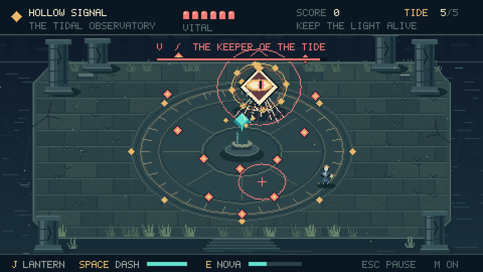

# Hollow Signal

**A lantern against the tide.** A complete, roughly two-minute arena action game
written in μDewy. Survive four tides in a ruined observatory, shape your lantern
with gifts between encounters, then defeat the Keeper of the Tide.



## Play

Run these commands from the repository root:

```bash
# Native Linux: SDL3 + OpenGL
python -m udewy udewy/tests/hollow_signal/hollow_signal.udewy

# Browser: WebAssembly, opens a self-contained HTML file
python -m udewy --target wasm32 udewy/tests/hollow_signal/hollow_signal.udewy
```

Native prerequisites are the repository's SDL bundle and a working OpenGL 2.1
compatibility context. If SDL has not been built yet:

```bash
python udewy/third_party/sdl/setup_sdl.py
```

The browser build requires `wat2wasm` from WABT. It needs no SDL, asset downloads,
JavaScript packages, web server, or network access at play time. The first key
press unlocks browser audio. A keyboard is required; touch controls are not
implemented.

To compile without launching:

```bash
python -m udewy -c udewy/tests/hollow_signal/hollow_signal.udewy
python -m udewy -c --target wasm32 udewy/tests/hollow_signal/hollow_signal.udewy
```

Outputs are `__dewycache__/udewy/tests/hollow_signal/hollow_signal` and
`__dewycache__/udewy/tests/hollow_signal/hollow_signal.html`. The HTML is the whole
browser game: copy it anywhere or put it on any static host. The hosted C backend
also works with `--target c` and the same native SDL bundle.

## Controls

| Key | Action |
| --- | --- |
| Enter | Start, confirm a gift, resume, or retry |
| WASD / arrows | Move; diagonal speed is normalized |
| Hold J | Fire the lantern; it aims at the nearest active enemy |
| Space / K | Dash in your movement direction, or last facing direction |
| E | Nova, when its charge bar is full |
| 1 / 2 / 3 | Choose a gift between tides |
| Arrows + Enter | Alternative gift selection |
| Esc / P | Pause / resume |
| M | Toggle all audio |

**Dash through enemies.** You are invulnerable during the dash, it deals heavy
damage once per enemy, and dash kills reduce its cooldown. Brief presses are
buffered through hit-stop. Coral circles mark spawning enemies and ground
attacks; leave a ground warning before its inner ring reaches the outside.

**Collect the embers.** Teal shards charge Nova, which damages every active enemy
and erases hostile projectiles and ground attacks. Red crosses restore one
vital. Nearby drops fly toward you; after a tide, remaining drops are gathered
automatically.

**Build your lantern.** Prism adds damage and unlocks triple shots at its second
level. Quickwick increases fire rate. Undertow improves dash damage and cooldown,
and adds maximum health. Every gift restores two vital and adds Nova charge.
Builds can be mixed, and each gift stacks.

**Keep a chain.** Rapid kills build a multiplier up to 8×. Taking damage breaks
the chain. Finishing with more health earns a bonus. Best score lasts for the
current application session; closing/reloading the game clears it.

## What's inside

- Five encounters, four enemy types, an escalating boss with radial volleys,
  aimed shots, summoned enemies, and delayed ground attacks.
- Original pixel character sprites and a software-rendered 480×270 scene:
  weathered stonework, engraved astrolabe, ruined columns, animated water,
  suspended spores, lanterns, and a separate illustrated title screen.
- Acceleration, soft enemy separation, hit flashes, impact freezes, camera shake,
  dash trails, particle bursts, spawn/attack warnings, pickup attraction, and
  target indicators. The renderer preserves the aspect ratio on both targets.
- An original D-minor sequence with bass, arpeggios, pads and percussion, plus
  eight polyphonic effects voices. All PCM is synthesized in μDewy.
- One deterministic fixed-point simulation at 60 Hz, independent of display
  refresh rate. Long host stalls pause play rather than advancing danger.

`core.udewy` contains the complete simulation. `render.udewy` contains the art
and software renderer. `audio.udewy` contains the synthesizer. `frame.udewy`
handles time accumulation and input edges. The two platform adapters only handle
presentation, keyboard input, timing, and PCM output. No game logic lives in
Python, JavaScript, C, or shaders.

The SDL setup is adapted from the repository's μCrypt example, and `font.udewy`
reuses μZero2's 5×7 bitmap font. All other game content is specific to Hollow
Signal. No external art or audio files are loaded. `preview.png` is documentation
only.

The stock browser canvas host uses a fixed framebuffer address. The WASM adapter
reserves that memory range before game statics so the large scene cache and
strings cannot overlap it; no compiler/runtime modifications are necessary.

## Verification

```bash
# Native/C simulation agreement, all game builds, six guarded render fixtures
python udewy/tests/hollow_signal/verify.py

# Also exercise an actual SDL window and Chromium keyboard/audio/rendering
# Development dependencies only: pip install playwright; playwright install chromium
python udewy/tests/hollow_signal/verify.py --sdl --browser
```

The suite checks combat, dash invulnerability, one hit per dash, buffered input,
Nova, ground warnings, upgrades, pause/restart, boss patterns, victory, and three
complete campaigns driven solely through normal player input. It compares exact
results across x86_64, C, and WebAssembly. Separate timing tests cover 30, 60, and
144 Hz hosts. Render fixtures check framebuffer guards and initialized RGBA
pixels across title, combat, upgrade, boss, pause, and victory screens. The SDL
check opens and resizes a real window, checks OpenGL errors, then closes it.
Browser checks also write screenshots into the build cache.
